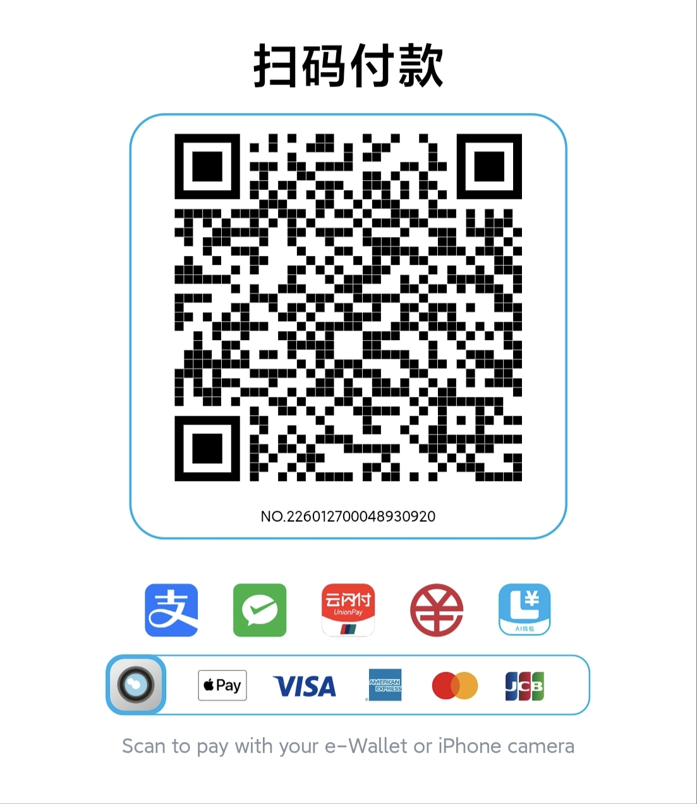

# Credit Cards Manager

A privacy-focused Android application for managing credit card information and benefits activities efficiently.


---

## 📱 Overview

**Credit Cards Manager** is a fully offline credit card management tool dedicated to providing users with secure and convenient credit card information management services. The app is completely ad-free, all features are free to use, and there are no usage restrictions.

---

## ✨ Features

### 💳 Card Management
- **Multi-card Management**: Add and manage multiple credit cards
- **Debit Card Management**: Debit card management now supported, unified management with credit cards
- **Card Association**: Supports 1-to-many relationships for flexible primary and supplementary card management
- **Stacked Switching**: New card stacking switch animation for smoother browsing experience
- **Information Statistics**: Intuitive display of credit card data statistics
- **Smart Reminders**: Important date reminders for billing dates, payment due dates, etc.

### 🎁 Benefits & Activities Management
- **Smart Creation**: One-click intelligent activity creation, quickly bind cards with benefits
- **Points Management**: Track and manage point programs from various banks
- **Cashback Activities**: Monitor various spending cashback discounts
- **Benefits Management**: Unified management of credit card benefit activities
- **Activity Categorization**: Multi-dimensional categorization for different activity types

### 🔒 Security & Privacy
- **App Lock**: New app lock feature to protect private data
- **Fully Offline**: All data stored locally, no internet required
- **Ad-Free**: Clean user experience without any advertisements
- **Unlimited**: All features freely available with no usage limits
- **Data Security**: User data is completely under your control

---

## 🏗️ Architecture

```
credit_cards_manager/
├── app/                    # Main application module
├── data/                   # Data layer (local database)
├── domain/                 # Business logic layer
└── presentation/           # UI presentation layer
```

---

## 📥 Installation

1. Download the latest APK installer
2. Enable "Install from unknown sources" on your Android device
3. Run the APK file to complete installation

---

## 📦 Releases

### Latest Release

| Version | Release Date | Download | Description |
|:----:|:--------:|:----:|:-----|
| lateast | - | [Gitee releases](https://gitee.com/aachen0/credit_cards_manager_repo/releases) | For details, please refer to the release page. |
| v1.6.0 | 2026-05-05 | [📥 Download APK](releases/app-release1.6.0.apk) | New desktop widget (Xiaomi support), biometric/PIN service optimization, stacked card component optimization |
| v1.5.7 | 2026-05-04 | — | Refactored daily reminder feature to ensure accurate daily reminders |
| v1.5.6 | 2026-05-03 | — | New clipboard bill parsing, pending amount management, quick card switching; optimized theme and Snackbar styles, persistent notifications, debit card bank sorting, real-time activity/stat badge refresh |
| v1.5.5 | 2026-05-01 | — | New daily scheduled reminders, custom bank sorting, activity reminders; optimized payment sorting, activity status judgment, notification content, state persistence |

### Release History

| Version | Release Date | Download | Description |
|:----:|:--------:|:----:|:-----|
| v1.5.4 | 2026-04-28 | — | Optimized bank management UI, removed drag restrictions, adjusted color picker parameters |
| v1.5.3 | 2026-04-29 | — | New bank management interface and bank selector component, adjusted and optimized menu entry |
| v1.5.2 | 2026-04-29 | — | Activity now supports one-click add to calendar |
| v1.5.1 | 2026-04-28 | — | Optimized activity reminder timing |
| v1.5.0 | 2026-04-28 | — | New app lock, one-click intelligent activity creation, debit card management, card stacking switch animation |
| v1.1.0 | 2026-04-13 | — | First public release |

> Earlier versions available at [Tags](/tags)

---

## 📖 Usage Guide

1. **Add Credit Card**: Tap the "+" button on the home page and fill in card information
2. **Manage Activities**: Create activities on the activities page and associate with corresponding credit cards
3. **View Statistics**: Check various data summaries on the statistics page
4. **Set Reminders**: Configure billing and payment reminders in settings

---

## 📸 Screenshots

### Credit Cards Manager
<div align="center">

</div>

### Activity Management
<div align="center">

</div>

### Statistics
<div align="center">

</div>

### Payment Reminders
<div align="center">

</div>

### Card Details
<div align="center">

</div>

---

## 🤝 Contributing

We welcome any form of contribution!

1. Fork this repository
2. Create a `Feat_xxx` branch
3. Commit your changes
4. Create a Pull Request

---

## 📄 License

MIT License

---

## 💖 Donations

This software is completely free and open source. If you find this project helpful, feel free to buy the author a coffee ☕

### Donation Instructions

> 💡 **Donation Notes**
> - All donations will support the continued development and maintenance of the project
> - Donations are completely voluntary with any amount
> - You can include notes about features or suggestions with your donation

 <div align="center">

</div>

### <span style="color:red">For the latest versions, please contact me with whatsapp!</span>
<div align="center">

</div>

### Acknowledgments

Thank you to all users who support this project! 🎉

---

## 📞 Contact

For questions or suggestions, feel free to submit an Issue.

---

<div align="center">

**Credit Cards Manager — Simplifying Credit Card Management**

⭐ If this project is helpful to you, please give it a Star!

</div>
