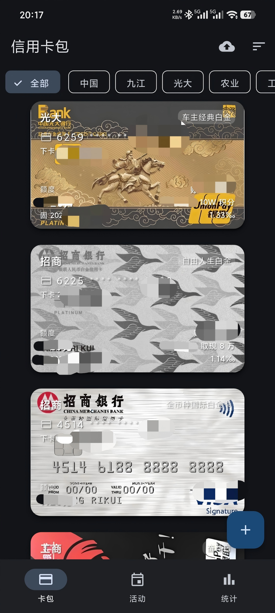
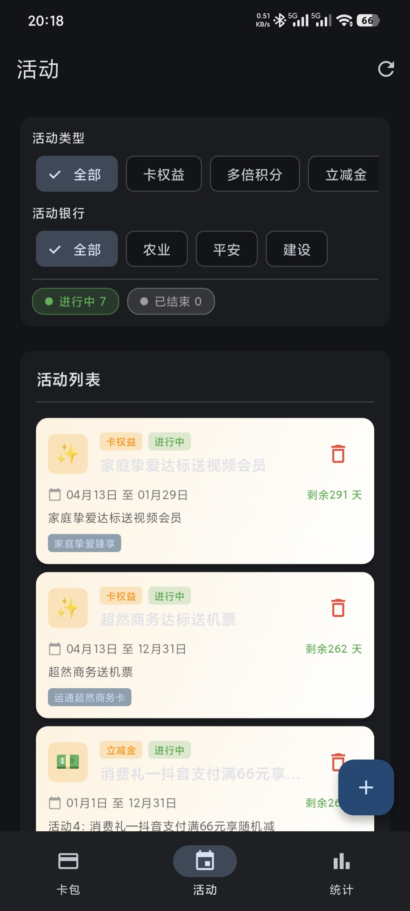
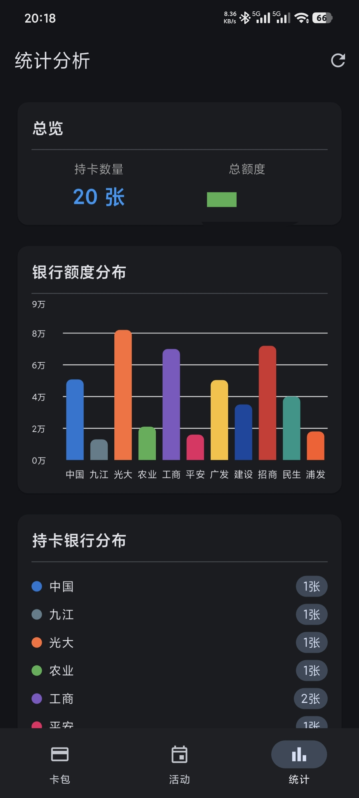
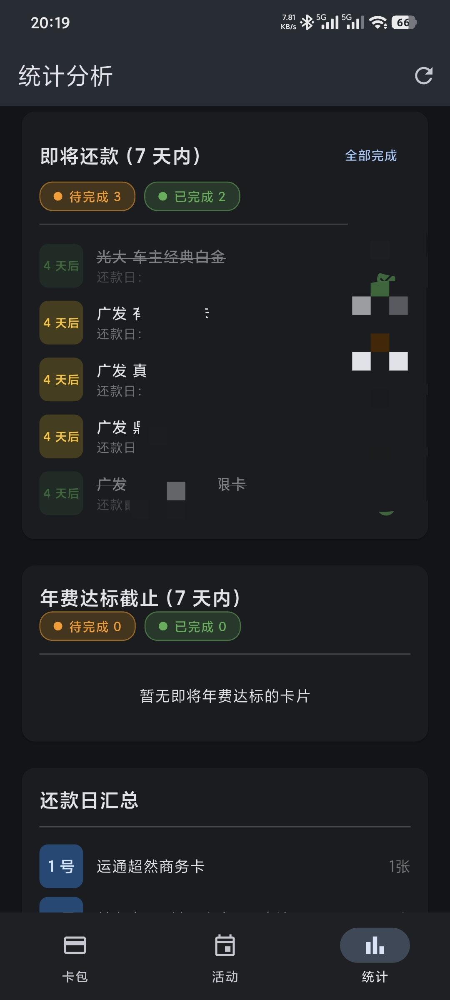
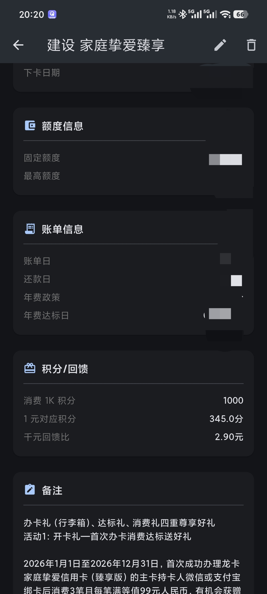

# 信用卡管家 - Credit Cards Manager

一款专注于信用卡信息管理的 Android 应用，帮助您高效管理多张信用卡及各类权益活动。


---

## 📱 软件简介

**信用卡管家** 是一款完全离线的信用卡管理工具，致力于为用户提供安全、便捷的信用卡信息管理服务。软件无任何广告，所有功能均可免费使用，无需担心任何使用限制。

---

## ✨ 核心功能

### 💳 卡片管理
- **多卡管理**：支持添加和管理多张信用卡信息
- **借记卡管理**：新增借记卡管理功能，信用卡与借记卡统一管理
- **卡片关联**：支持 1 对多关联，灵活管理主卡与附属卡
- **堆叠切换**：新增卡片堆叠切换动画，浏览体验更流畅
- **信息统计**：直观展示信用卡各类数据统计
- **智能提醒**：账单日、还款日等重要日期提醒

### 🎁 活动权益管理
- **智能创建**：一键智能创建活动，快速绑定卡片与权益
- **积分管理**：记录和管理各银行积分活动
- **立减活动**：跟踪各类消费立减优惠
- **权益管理**：统一管理信用卡各类权益活动
- **活动分类**：支持多维度分类管理不同活动类型

### 🔒 安全隐私
- **应用锁**：新增应用锁功能，保护隐私数据安全
- **完全离线**：所有数据本地存储，无需联网
- **无广告**：纯净使用体验，无任何广告干扰
- **无限制**：所有功能免费开放，无使用次数限制
- **数据安全**：用户数据完全由自己掌控

---

## 🏗️ 软件架构

```
credit_cards_manager/
├── app/                    # 应用主模块
├── data/                   # 数据层（本地数据库）
├── domain/                 # 业务逻辑层
└── presentation/           # 界面展示层
```

---

## 📥 安装教程

1. 下载最新版本的 APK 安装包
2. 在 Android 设备上允许"未知来源应用"安装
3. 运行 APK 文件完成安装

---

## 📦 版本发布

### 最新发布

| 版本 | 发布日期 | 下载 | 说明 |
|:----:|:--------:|:----:|:-----|
| v1.5.2 | 2026-04-29 | [📥 下载 APK](releases/app-release1.5.2.apk) | 活动增加一键添加到日历日程功能 |

### 历史版本

| 版本 | 发布日期 | 下载 | 说明 |
|:----:|:--------:|:----:|:-----|
| v1.5.1 | 2026-04-28 | [📥 下载 APK](releases/app-release1.5.1.apk) | 优化活动提醒更新时机 |
| v1.5.0 | 2026-04-28 | [📥 下载 APK](releases/app-release1.5.0.apk) | 新增应用锁、一键智能创建活动、借记卡管理、卡片堆叠切换动画 |
| v1.1.0 | 2026-04-13 | [📥 下载 APK](releases/app-release1.1.0.apk) | 首个公开发布版本 |

> 更早版本可在 [Tags](/tags) 页面查看

---

## 📖 使用说明

1. **添加信用卡**：首页点击"+"按钮，填写卡片信息
2. **管理活动**：在活动页面创建并关联对应信用卡
3. **查看统计**：统计页面查看各类数据汇总
4. **设置提醒**：在设置中配置账单和还款提醒

---

## 📸 应用截图

### 信用卡包
<div align="center">

</div>

### 活动管理
<div align="center">

</div>

### 统计分析
<div align="center">

</div>

### 还款提醒
<div align="center">

</div>

### 卡片详情
<div align="center">

</div>

---

## 🤝 参与贡献

我们欢迎任何形式的贡献！

1. Fork 本仓库
2. 新建 `Feat_xxx` 分支
3. 提交代码
4. 新建 Pull Request

---

## 📄 开源协议

MIT License

---

## 💖 捐赠支持

本软件完全免费且开源，如果您觉得这个项目对您有帮助，欢迎通过以下方式请作者喝杯咖啡 ☕

### 捐赠方式

> 💡 **捐赠说明**
> - 所有捐赠将用于支持项目的持续开发和维护
> - 捐赠完全自愿，金额不限
> - 您可以在捐赠时备注想要的功能或建议
 **

### <span style="color=red">如需获取持续最新版本，请添加qq群下载！</span>
** 

### 致谢名单

感谢所有支持本项目的用户！🎉

<!-- 在此处添加捐赠者名单 -->

---

## 📞 联系方式

如有问题或建议，欢迎提交 Issue。

---

<div align="center">

**信用卡管家 — 让信用卡管理更简单**

⭐ 如果这个项目对您有帮助，请给一个 Star！

</div>
